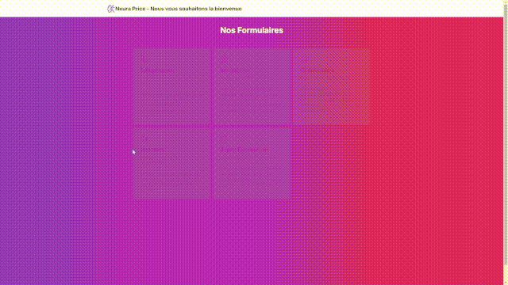

<h1 align="center">
  <br>
  
  <br>
  NeuraPrice
  <br>
</h1>

<h4 align="center">Une application dédiée à la prédiction de prix basée sur des modèles neuronaux avancés.</h4>

<p align="center">
  <a href="https://opensource.org/licenses/MIT">
    
  </a>
</p>


<p align="center">
  <a href="#features">Fonctionnalités</a> •
  <a href="#installation">Installation</a> •
  <a href="#utilisation">Utilisation</a> •
  <a href="#credits">Crédits</a> •
  <a href="#contribution">Contribution</a> •
  <a href="#licence">Licence</a>
</p>

<p align="center">
  <a>
    
  </a>
</p>

## Fonctionnalités

- **Prédiction de prix basée sur l'IA** : Utilisation de modèles neuronaux avancés pour analyser les tendances de marché.
- **Visualisation des prédictions** : Interface compréhension intuitive des prévisions.
- **Support multi-plateforme** : Compatible avec Windows, macOS et Linux.

## Installation

Pour cloner cette application, vous aurez besoin de [Git](https://git-scm.com) installé sur votre ordinateur puis d'éxecuter ces commandes depuis votre terminal :

```bash
# Clonez ce dépôt
git clone https://github.com/Florian-DAUVERGNE/NeuraPrice

# Accédez au répertoire du projet
cd NeuraPrice
```
Pour démarrer l'API, vous aurez besoin de [Python 3](https://www.python.org/downloads/) et d'exécuter :
```bash
# Créez un environnement virtuel et activez-le
cd Backend\API

python3 -m venv venv
source venv/bin/activate  # Sous Windows : venv\Scripts\activate

# Installez les dépendances
pip install -r requirements.txt

# Lancez l'application
flask --app API.py run
```

Pour démarrer l'interface, vous aurez besoin de [pnpm](https://pnpm.io/fr/installation) et d'exécuter :
```bash
cd Frontend

pnpm i

pnpm run dev
```

## Utilisation de l'interface

1. Lancez l'interface avec les commande précédente.
2. Répondez aux formulaires.
3. Visualisez les prédictions de prix et analysez les tendances du marché.

## Utilisation de l'API

1. Lancez l'API avec les commande précédente.
2. Dirigez vous sur cette url : http://127.0.0.1:5000/apidocs/.

## Crédits

Ce projet utilise les ressources open-source suivantes :

- [TensorFlow](https://www.tensorflow.org/) - Framework pour l'apprentissage profond
- [Pandas](https://pandas.pydata.org/) - Manipulation et analyse de données
- [Matplotlib](https://matplotlib.org/) - Visualisation de données
- [Scikit-learn](https://scikit-learn.org/) - Outils d'apprentissage automatique
- <a href="https://fr.freepik.com/icone/reseau-neuronal_12392217#fromView=search&page=1&position=55&uuid=c622a4c5-bf69-4d82-aecf-40b93c5dbffa">Freepik</a> - Ressources Images

## Contribution

Les contributions sont les bienvenues !

1. Forkez le projet
2. Créez votre branche de fonctionnalité (`git checkout -b feature/NouvelleFonctionnalite`)
3. Commitez vos modifications (`git commit -m 'Ajout d'une nouvelle fonctionnalité'`)
4. Pushez sur la branche (`git push origin feature/NouvelleFonctionnalite`)
5. Créez une Pull Request

## Licence

Ce projet est sous licence MIT - consultez le fichier [LICENSE](LICENSE) pour plus de détails.

